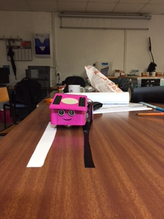

DETECTATOR
=================

Présentation et objectifs
--------------------------
Détectator va permettre à l'arduino de réagir suivant la couleur de marquage au sol.

Pré-requis
-----------
*Avoir installé le logiciel arduino
*Carte arduino
*Capteur de niveau de gris : DFR0022
*Cables jumper

Tuto Detectator
--------------
**Etape 1** : 

Après avoir préparé le matériel, nous commençons à relier les éléments selon le shémas dont le lien est renseigné ci-dessous

**Etape 2** : 

Ci-dessous,le programme qui va permettre à l'arduino de connaître la couleur de marquage au sol.
Vous constaterez que lorsque l'intensité du capteur est inférieur à 150, c'est qu'il détecte du blanc, losque l'intensité est supérieur à 300, c'est qu'il détecte du noir.
En dehors de ces deux données, le capteur détecte une couleur qui n'est ni du blanc ni du noir.

**Etape 3** :

```Cpp
void setup()
{
  Serial.begin(9600); // open serial port, set the baud rate to 9600 bps
}
void loop()
{
      int val;
      val=analogRead(A0);   //connect grayscale sensor to Analog 0
      Serial.println(val,DEC);//print the value to serial

      if(estBlanc())
        Serial.println("BLANC");
      else if(estNoir())
        Serial.println("NOIR");
      else
        Serial.println("???");
      delay(100);
}

boolean estBlanc(){
      int val;
      val=analogRead(A0);
      return val <150;
}

boolean estNoir(){
      int val;
      val=analogRead(A0);
      return val > 300;
}
```

** Etape 4 **




Schéma de câblage du capteur à l'arduino
----------------------------------------
Cliquer sur le lien ci-dessous

https://www.dfrobot.com/wiki/index.php/DFRobot_Grayscale_Sensor_(SKU:DFR0022)
